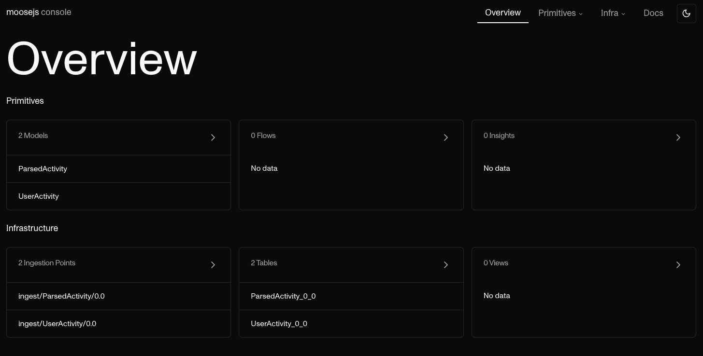

# Walkthrough

In this walkthrough we will cover:

- How to setup multiple versions of your data models in a moose application.
- How to deprecate old versions of your data models

**Requirements**

- [NodeJS](https://nodejs.org/en/)
- [Docker](https://www.docker.com/)
- macOS / Linux / Windows (Working in the Linux Subsystem)

## Initialize a new project

In order to start this, we will start from a blank page, this will illustrate the concepts we are talking
about and make sure we all start from the same point.

In the terminal, go to a direction where you wish to run your experiement.

```
$ cd ~
```

```
$ npx create-moose-app@latest dcm-walkthrough
```

```
$ cd dcm-walkthrough
```

At the end of the initialization process, you will have 2 data models already defined, and the inside
of your app folder should look like the following:

```
$ tree
.
├── app
│   ├── README.md
│   ├── datamodels
│   │   └── models.prisma
│   ├── flows
│   │   └── UserActivity
│   │       └── ParsedActivity
│   │           └── flow.ts
│   └── insights
│       ├── charts
│       └── metrics
├── package.json
└── project.toml
```

When you run

```
$ npx @514labs/moose-cli@latest dev
```

We will spin up a dev infrastructure for you to start building your moose app.

Go to `http://localhost:3001` from your browser. You should see the following console:



As you can see here, you have a table provisioned with the suffix `0_0` for `v0.0`
which is the default version in your package.json.

## Defining a new version of the `UserActivity` data models

The state of your files in your git repository correspond to the latest version of
your data model.

With `moose` you can have multiple version of your datamodel deployed at the same time. That
allows you to have loose coupling between your data infrastructure and the other parts of the
data ecosystem (application that are emiting the data, databases you extract data from, etc...)

When you deploy a new version of your datamodel to be available for consumers or producers to
put data into, you have the ability to keep your old version of the data model up and running.
The 2 versions of a data model are linked together by a contiuous data migration process.

Differently said, if data comes into your old model, the sync will bring it to your new model.

Enough talking, let's show it to you in action.

1. With your favorite text editor, open the `models.prisma` file above
2. Delete the line that says `activity` in the `UserActivity` data model
3. Stop the dev server if you had it running
4.
